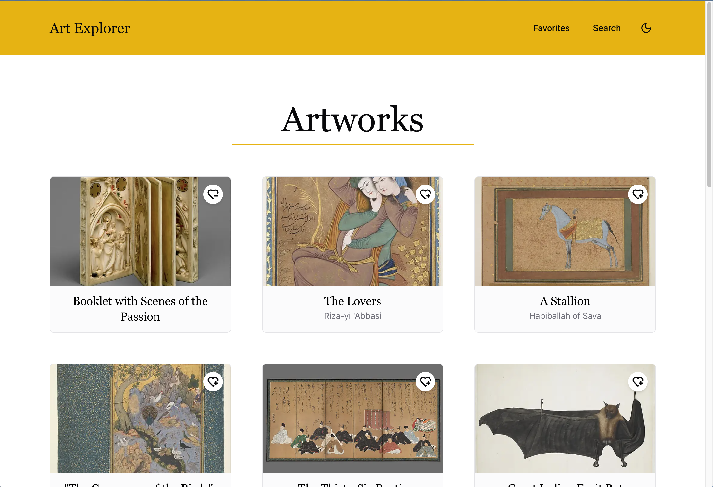

# Art Explorer

## Descrição

Art Explorer é uma aplicação web que permite explorar obras de arte da coleção do Metropolitan Museum of Art (The Met). As principais funcionalidades são:

- Buscar obras com imagem
- Visualizar detalhes das obras
- Marcar como favorita
- Listar favoritas
- Procurar obras por departamento ou artista

## Preview



## Tecnologias

- [React](https://react.dev/)
- [Next.js](https://nextjs.org/)
- [TypeScript](https://www.typescriptlang.org/)
- [TailwindCSS](https://tailwindcss.com/)
- [Axios](https://axios-http.com/)
- [React Query](https://tanstack.com/query/latest)
- [Zustand](https://zustand-demo.pmnd.rs/)
- [React Hook Form](https://react-hook-form.com/)
- [Zod](https://zod.dev/)
- [Motion](https://motion.dev/)
- [Vitest](https://vitest.dev/)
- [React Testing Library](https://testing-library.com/docs/react-testing-library/intro/)
- [Biome](https://biomejs.dev/)
- [Shadcn UI](https://ui.shadcn.com/)

## API do The Met Museum

- [The Met Museum API](https://metmuseum.github.io/)

## Rodando o projeto

```bash
# Instalar dependências
pnpm install

# Rodar o projeto
pnpm dev
```

## Melhorias que podem ser implementadas

- [ ] Adicionar tratamento de erro nas server actions com mensagens para o usuário
- [ ] Deixar o fetch mais robusto, adicionando um novo objectID caso alguma promise seja rejeitada, retornando assim um array com 15 itens
- [ ] Adicionar um botão para limpar buscas e filtros
- [ ] Adicionar traduções com i18n
- [ ] Melhorar estrutura de módulos e arquivos compartilhados
- [ ] Adicionar testes unitários para componentes visuais
